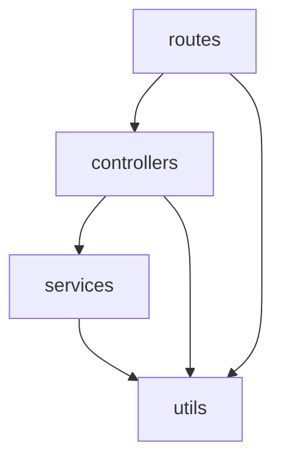

## 啟動 server
1. 開啟終端機，cd 到存放專案位置並執行:
```
git clone https://github.com/Rubyrubylai/hero.git
```
2. 下載 docker，使用 docker CLI
```
docker-compose up web
```
3. 在 web 資料夾底下新增 .env 檔案，並寫入以下環境變數
```
NAME=hahow
PASSWORD=rocks
```
4. 在本機端 http://localhost:3000/heroes 開啟網址
5. 自動化測試
```
docker-compose up test
```

## 專案架構

* routes：負責路由，URL 和控制器之間的關係
* controllers：負責調用相對應的服務來處理請求
* services：負責應用程序的商業邏輯
* utils：放置通用的函式

## 第三方套件
- 用於 server
	- axios
		- 用於發送 HTTP 請求和處理響應
		- 可以發送 GET、POST、PUT、DELETE 等請求
	- dotenv
		- 將機敏資料等環境變數放置在 .env 檔案裡，並利用 gitignore 忽略 .env，使這些資料不受版本控制
		- 透過 dotenv 可存取檔案裡的環境變數
	- express
		- Node.js 的框架
		- 提供路由系統，並支援模板引擎及 middleware
	- nodemon
		- 監控 Node.js 的程式碼更改，並在發生更改時自動重新啟動應用程序，讓開發人員在每次更改程式碼後不須重新啟動應用程序
	- winston
		- 日誌記錄工具
		- 提供不同的日誌級別，開發人員可以根據需求紀錄不同類型的日誌
- 用於測試
	- mocha
		- JavaScript 的測試框架
	- chai
		- JavaScript 的斷言庫，用於為測試框架提供斷言功能，確定程式碼執行結果是否符合預期
	- sinon
		- JavaScript 的測試框架，提供模擬的功能
		- 如果要測試的函式依賴於另外一個我們無法控制的函式，可以透過 sinon 進行模擬測試，避免因相依性而導致測試上的問題
		- 具有 stub, spy, mock 功能
			- stub：用来代替實際函式，控制函式的行為，回傳指定的值。通常用於模擬處理需要的資源或服務，例如：數據庫、API 等
			- spy：紀錄函式的調用、參數、返回值等。可以驗證程式碼是否正確地使用函式，以及是否使用正確的參數
			- mock：可以做任何 spy 和 stub 的所有事，用於要驗證許多特別的行為時
	- supertest
		- Node.js 的測試框架，用於對 HTTP 服務進行測試

## 註解撰寫
- 原則
	- 不過於冗長
	- 說明程式碼的目的，而非程式碼本身
- 時機
	- 程式碼複雜時
	- 程式碼含有特殊商業邏輯時
	- 可能導致錯誤的程式碼
	- 暫時 hotfix，而之後需要被修改的程式碼
